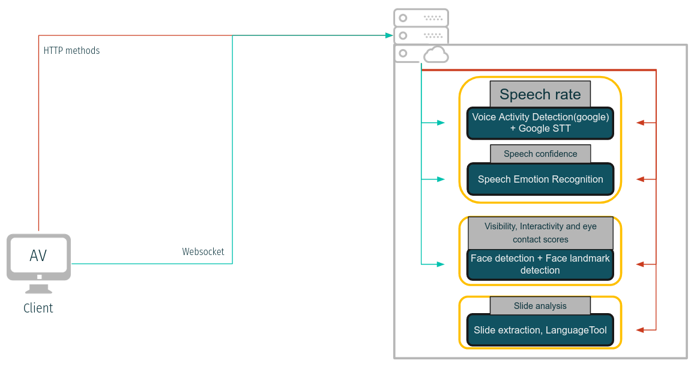

<h1 align="center">Welcome to mock-buddy 👋</h1>
<p>
  <a href="#" target="_blank">
    
  </a>
  <a href="https://codecov.io/gh/Karthick47v2/mock-buddy" > 
     
  </a>
</p>

## IMPORTANT
Website won't be available for a while after November 28th, 2022 as Heroku stop offering free Heroku Dynos. I will try to deploy to cloud using other providers when I have time,in the meantime, you can host backend on your localhost.

## 🏠 [Homepage](https://Karthick47v2.github.io/mock-buddy)

Communication is the most important skill for improving our career. We all had haunted by the fear of public speaking at some point. Not only speaking on stage in front of hundreds of people, it could be school presentations, university viva / presentations and job interviews. Some people overcome this, but most of the people still didn’t have confidence in speaking. The only way to overcome this is, practicing by yourself. But there is a catch, you can’t practice by yourself because you need other one to give feedback about how you perform. If you have a good circle, then they can help you out. What if they are also like you? and everyone is not going to be there all time. Or, you can consult a therapist or coach and pay them to improve your ability. But, do you really need to pay couple of bucks to improve your skills ?? is this a video game? Mock- Buddy an AI assisted listener, is there for you to listen to all your talks and give feedback about it for free. Mock-Buddy’s vision is to empower everyone around the world to overcome the fear of public speaking and give a career boost.

Supporting repositories,

- Back-end (Microservices)-> [mock-buddy-video-server](https://github.com/Karthick47v2/mock-buddy-video-server), [mock-buddy-audio-server](https://github.com/Karthick47v2/mock-buddy-audio-server), [mock-buddy-slide-server](https://github.com/Karthick47v2/mock-buddy-slide-server)
- Face landmark detector training -> [face-landmark-detector](https://github.com/Karthick47v2/face-landmark-detector)
- Speech emotion classifier training -> [speech-emotion-classifier](https://github.com/Karthick47v2/speech-emotion-classifier)

Below shown high-level diagram represents the workflow,



Screenshots:


# Development

## Prerequisites

- Node.js >= 16

## Install

```
npm install --force
```

## Usage

\*Tested on Firefox and Google Chrome

```
npm start
```

> App should now be running on http://localhost:8080/

## Run tests

You can also view the code coverage report [here](https://app.codecov.io/gh/Karthick47v2/mock-buddy)

```
npm test
```

## Author

👤 **Karthick T. Sharma**

- Github: [@karthick47v2](https://github.com/karthick47v2)
- LinkedIn: [@karthick47](https://linkedin.com/in/karthick47)

## 🤝 Contributing

Contributions, issues and feature requests are welcome!<br />Feel free to check [issues page](https://github.com/Karthick47v2/mock-buddy/issues).

## Show your support

Give a ⭐️ if this project helped you!
